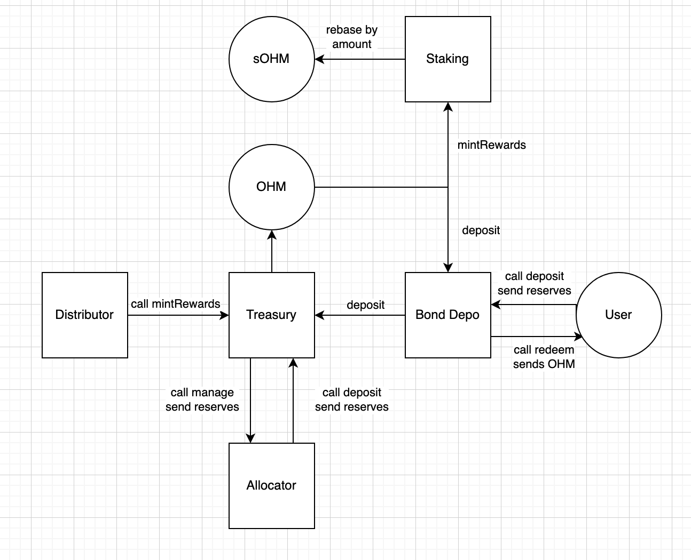
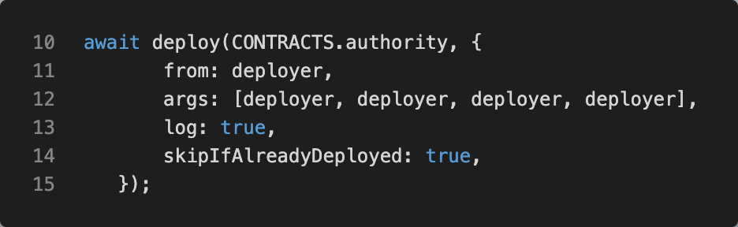
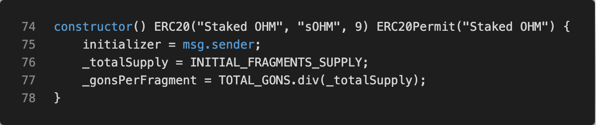

# Olympus V2 Smart Contract Analysis - Part 1: Deployment Scripts

## Overview
One of the best ways to come up to speed on solidity, smart contracts, DeFi, and Olympus V2 is to dive into the code. The following posts are my notes as I've been digging into the Olympus V2 contracts to better understand how it all works.

## Table of Contents
- [Main README](/README.md)
- --> **Part 1: Deployment Scripts**

# Notes:
- olympus-contracts `v2.0` tag was created 12/18/2021. Version-2 branch has existed for some time and as I have been researching this, it seems to have had some inconsistent deployment scripts and artifacts, but this is the first time they tagged the code and this looks to coincide with the Olympus v2 migration per [Get ready for Olympus V2 Migration](https://olympusdao.medium.com/get-ready-for-olympus-v2-migration-360764a61168) The code at this tag seems to be much more complete now and easier to follow what is being deployed, dependencies, etc. 
- v2.0 tag uses [hardhat-deploy](https://github.com/wighawag/hardhat-deploy/tree/master) to deploy the contracts, which is a hardhat plugin that provides a lot more structure, determinism, and control of deployments vs. the freeform scripts that have been traditionally used with hardhat (hardhat doesn't really have a good solution for deployment at the time of this writing)
- Had to adjust `scripts/constants.ts` `INITIAL_MINT` value so that the faucet would dispense OHM (was giving insufficient funds error)
  - `export const INITIAL_MINT = "6000000000000000000000"; // 6k DAI`
- To deploy a subset of the deployment scripts (i.e. scripts tagged `testnet`: `npx hardhat deploy --network localhost --tags testnet` 
  - Run in separate process
  - Will Reuse the deployed contracts and just redeploy Testnet
  - Uses the added `hardhat deploy` task provided by `hardhat-deploy` plugin
  - Note this warning regarding `hardhat` vs `localhost` networks at the bottom of the [hardhat-deploy task of the hardhat-deploy plugin](https://github.com/wighawag/hardhat-deploy/tree/master#1-hardhat-deploy):
  > :warning: Note that the deployments are saved as if the network name is `localhost`. This is because `hardhat node` is expected to be used as localhost: You can for example execute `hardhat --network localhost console` after `node` is running. Doing `hardhat --network hardhat console` would indeed not do anything useful. It still take the configuration from `hardhat` in the hardhat.config.js file though.
- **NB:** Reset your MetaMask deployer account, otherwise you might encounter nonce errors due to inconsistent account state or encounter other odd errors.

# Olympus Block Diagram (for reference)



# Deployment scripts `scripts/deploy/`

Contracts are deployed in this order:

1. Authority - Root level access control contract that defines various ownership and access roles for the rest of the contracts. [governor, guardian, policy, vault]
2. Migrator - Used to migrate from OHM v1 to OHM v2
3. sOHM - Staked OHM Token (ERC20), is provided when staking your OHM token
4. gOHM - governance OHM Token (ERC20) can stake OHM for governance tokens vs. sOHM
5. OHM - OHM Token (ERC20), the main currency of Olympus
6. Treasury - Manages all the tokens and value stores
7. Bonding Calculator
8. Staking - Manages staking and rebasing
9. Distributor - Distributes rewards to treasury

Additional deployment scripts:

10. Post deployment setup and initialization
11. Testnet with OHM Faucet

---
# Contract Analysis

Let's look at each of the contracts in term to understand what they do and their overall purpose

## Contract: Olympus Authority `OlympusAuthority.sol`

This is the top-level security contract that defines ownership and access roles for the rest of the contracts. 


  Olympus Authority defines the following roles
  
  - governor - has most access and is only one that can make changes to other roles in this contract
  - guardian
  - policy
  - vault

Deployment script `000_deploy_authority.ts`



All Olympus Authority roles are initialized to the deployer's address at first deployment of this contract. Subsequent contracts eventually change some of these roles.

---

## sOHM `sOlympusERC20.sol`

sOHM is the `staked OHM` ERC20 token 



---

## gOHM `governance/gOHM.sol`

---


## OHM `OlympusERC20Token.sol`

## Treasury

## Bonding Calculator

## Staking


## Distributor

Distributor is used by Staking to distribute staking rewards (epoch rewards) to each recipient specified in the `addRecipient` policy functions (TODO: verify this)

It seems at init of Olympus that you can specify distribution recipients (aka collectors). Maybe you're considered a recipient when you stake ohm, but I don't think this is the case. 

distributor is enabled to mint ohm on treasury in step 2 of `100_post_deployments.ts` treasury(8) is REWARDMANAGER

```ts
// Step 2: Set distributor as minter on treasury
await waitFor(treasury.enable(8, distributor.address, ethers.constants.AddressZero)); // Allows distributor to mint ohm.
```

- constants
  - ` rateDenominator = 1_000_000`
- vars
  - `Info[{rate, recipient}] public info` - recipient / collectors
  - bounty
- public functions
  - `distribute()` public
    - iterates through info[] and mints OHM tokens from treasurybased on recipient reward rate to recipient
  - `retrieveBounty()` public
    - Any distributor bounty goes to the staking contract
  - `adjust(_index)`
- policy functions
  - `setBounty(_bounty)` onlyGovernor
    - Set a bounty to incentivize keepers - there are several places in the staking call stack where bounty is returned by function. this seems to be where you'd set the bounty for the distributor contract
  - `addRecipient(_recipient, _rewardRate)`
    - inits and pushes recipients onto info[]
  - `removeRecipient(_index)` gov or guardian
  - `setAdjustment`

